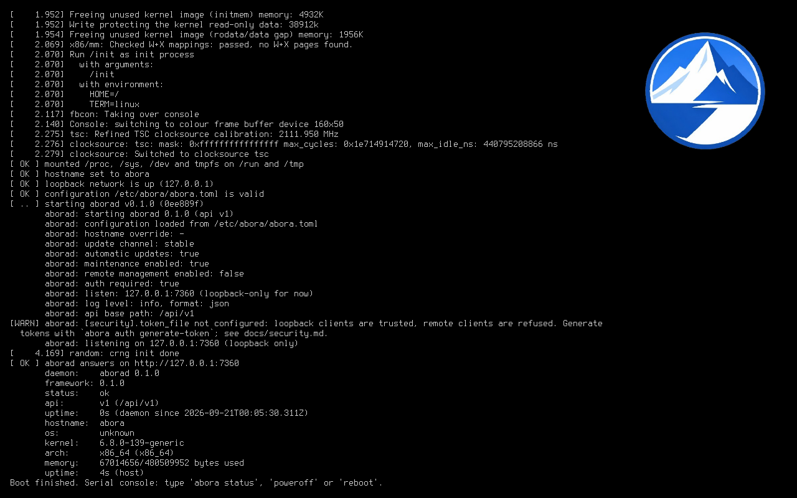

# Live ISO

`make iso` builds `build/abora-framework.iso`, a small bootable image that runs the
Abora Framework in RAM. `make run` boots it in QEMU: the **Abora logo** is drawn on
the right of the screen and the **boot log** (kernel messages, then each init step, then
`aborad`'s own log) scrolls as plain text beside it, the same text you see on the serial console.



## What is on it

| Piece | Where it comes from |
|-------|---------------------|
| Bootloader | [Limine](https://limine-bootloader.org) (BIOS and UEFI), fetched into `build/limine` on first build |
| Kernel | Ubuntu's generic Linux kernel (`apt-get download`, kernel image only, cached in `build/kernel`), or your own via `KERNEL=/path/to/vmlinuz` |
| Userspace | one initramfs: busybox (static), `aborad`, `abora`, `abora-boot`, `config/abora.toml.default` |
| Boot screen | `boot/abora-boot`: draws the plain-text log and `assets/abora-logo.png` through `/dev/fb0` (no `unsafe`, no dependencies) |
| Font | Terminus 8x16 from the system's console fonts (SIL OFL 1.1) |

`aborad`, `abora` and `abora-boot` are built statically (`+crt-static`, glibc) so
they run with nothing else in the image. Nothing touches your disks: the whole
system lives in RAM.

## Targets

```
make iso           build the ISO
make run           build it and boot it in a QEMU window (serial console on your terminal)
make run-headless  same, with no window
make boot-test     boot headless and check that aborad answered inside the ISO
make screenshot    save the screen to build/screen.ppm
```

Tools needed: `cargo`, `cpio`, `gzip`, `python3`, `git`, `make` and a C compiler (to build
Limine's host tool), `busybox-static`, one of `xorriso`/`genisoimage`/`mkisofs`, and
`qemu-system-x86_64` to run it. Fetching the kernel needs `apt-get`/`dpkg`; elsewhere
pass `KERNEL=`. Distribution kernels under `/boot` are often root-only, so copy one you can read.

Knobs: `LOGO=` (any 8-bit PNG), `FONT=` (a PSF1 font), `BUSYBOX=`, `KERNEL=`;
for QEMU: `ABORA_QEMU_MEM`, `ABORA_UEFI=1` (needs OVMF firmware).

## How the boot screen works

* Limine sets a 1280x800 framebuffer; the kernel's `simpledrm` driver exposes it as `/dev/fb0`.
* The kernel console is the **serial port only** (`console=ttyS0`), so kernel text never
  scribbles over the logo. `abora-boot` reads the kernel log from `/dev/kmsg` itself.
* `iso/init` reports each step by writing a line to `/run/boot.fifo`; `abora-boot` draws it
  and echoes it to the serial console. To add a boot step, add a line to `iso/init`.
* Because nothing prints to the virtual terminal, the display driver would never do its
  first mode set. `init` writes one glyph to `tty1` to make that happen (see the comment there).

## Using it

The screen is display-only. Keyboard input goes to the **serial console**, which is the
terminal that launched QEMU: try `abora status`, `poweroff` or `reboot`.

## Limitations

* Tested here in QEMU (software emulation, Linux host) with both BIOS and UEFI (`ABORA_UEFI=1`, OVMF). Not tried on real hardware or other hypervisors.
* The screen needs a 32-bit linear framebuffer. Anything else is reported and boot continues on serial only.
* Redistributing the ISO means redistributing a GPL kernel and busybox; keep their sources available.
* This is a demo image, not an installer. There is no networking, no persistence and no login.
